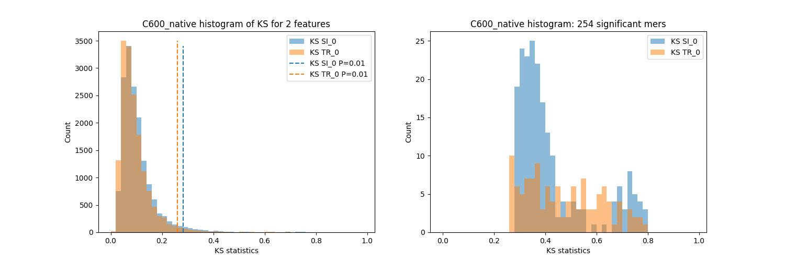
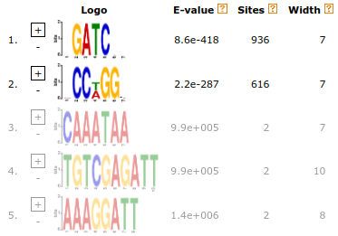
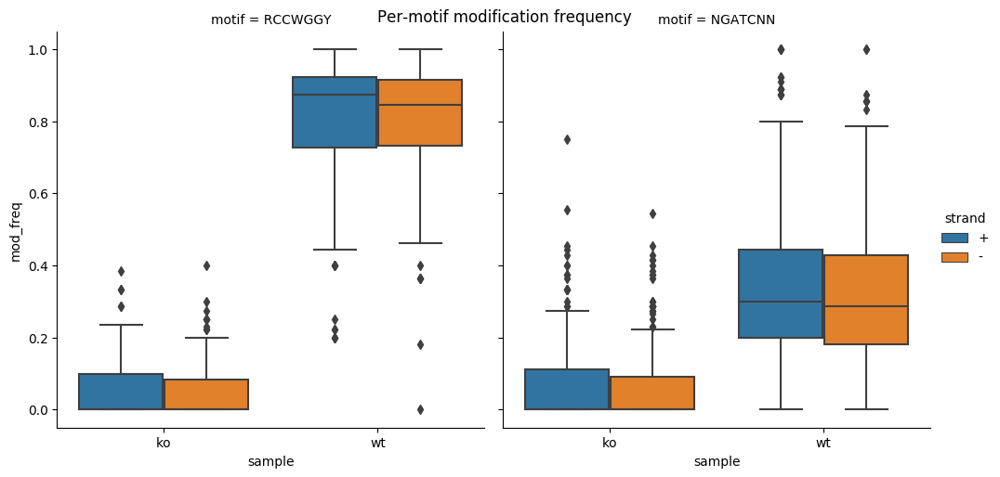

Visualisation
=============
The pipeline generate several figures.  

Kolmogorov-Smirnov test
-----------------------

Enriched motifs
---------------

Modification stoichiometry
--------------------------

Visualisation in genome browsers (IGV)
--------------------------------------
Since modificiation probabilites are encoded as base qualities,
you can visualise them directly in the genome browser such as
`IGV <https://software.broadinstitute.org/software/igv/>`_.

To do so:

#. open IGV,
#. load your reference genome (Genomes > Load genome from File... and select file ``ref/ECOLI.fa``),
#. load BAM files generated by nanoRMS2 (File > Load from File... and select ``.bam`` files inside ``outdir/encode`` folder),
#. load BED files generated by nanoRMS2 (File > Load from File... and select ``.bed`` files inside ``outdir/`` folder),
#. select some region ie ``NC_000913.3:22,653-22,809``
#. collapse alignments (mouse right-click and tick Collapsed)
#. make all bases visible (mouse right-click and tick Show all bases)
#. and shade by quality (mouse right-click and tick Shade base by quality)
#. optionally disable consensus mode that is enabled by default in the latest IGV (mouse right-click and untick Quick consensus mode). 

You should see something like this:

.. image:: NC_000913.3:22,653-22,809.png
   :align: center

Now you can easily see positions that contain modified bases:

* bedMethyl tracks (BED files) show different modified of canonical bases in different colours,
  plus the frequency of modification is depicted as the colour intensity
  (darker means more reads are modified at given position)
  
* and when you zoom-in you can clearly see the probability of this base being modified
  for every read and every base in the read - the intensity of base color is proportional
  to the probability of that base being modified.

Cool, right?

